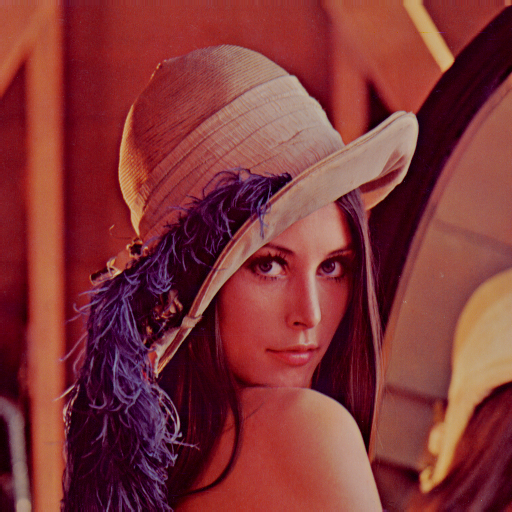
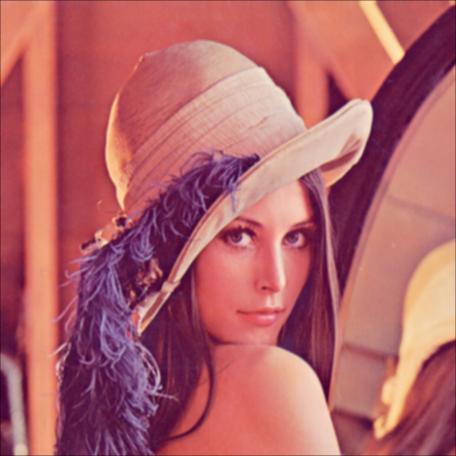
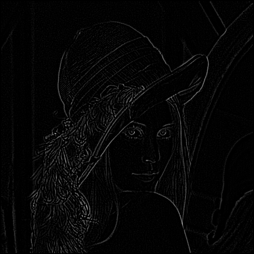
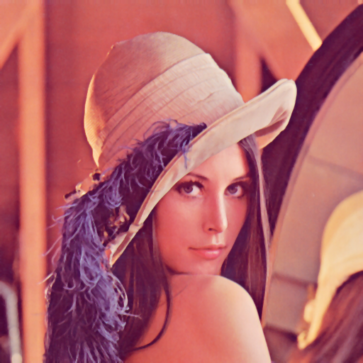

# Lab 1 - Image Processing with OpenCV (WSL)

## 1. Môi trường chạy (WSL)

Project được thiết kế để chạy trên **WSL (Ubuntu)** sử dụng **g++** và **OpenCV**.

### 1.1. Cài đặt phụ thuộc

Trong WSL (Ubuntu), chạy các lệnh sau:

```bash
sudo apt update
sudo apt install build-essential pkg-config libopencv-dev
```

Các package này cung cấp:
- `g++`, `make`: công cụ build cơ bản.
- `pkg-config`: tự động tìm cflags/libs của OpenCV.
- `libopencv-dev`: thư viện và header OpenCV (opencv2/...).

### 1.2. Mở project trong VS Code (khuyến nghị)

1. Cài extension **Remote - WSL**.
2. Từ Windows, mở VS Code → `Ctrl+Shift+P` → `WSL: Open Folder in WSL...` → chọn thư mục project, ví dụ:
   - `/mnt/d/Coding/School/Y3-K2/TGMT/Cpp/Lab1`
3. Dùng terminal trong VS Code (WSL) để build/chạy.

## 2. Cấu trúc project

- `Makefile` : file build chính, dùng `pkg-config` để link OpenCV.
- `src/`      : mã nguồn C++
  - `main.cpp`        : điểm vào chương trình, đọc tham số dòng lệnh, gọi hàm xử lý ảnh tương ứng.
  - `functions.cpp`   : ánh xạ chuỗi lệnh (ví dụ `-rgb2gray`) sang hàm xử lý.
  - `rgb2gray.cpp`    : chuyển ảnh màu sang xám.
  - `brightness.cpp`  : chỉnh độ sáng.
  - `contrast.cpp`    : chỉnh độ tương phản.
  - `avg.cpp`         : lọc trung bình (average filter).
  - `med.cpp`         : lọc trung vị (median filter).
  - `gau.cpp`         : lọc Gauss (Gaussian blur).
  - `sobel.cpp`       : phát hiện biên dùng toán tử Sobel.
  - `laplace.cpp`     : phát hiện biên dùng toán tử Laplace.
  - `convolution.cpp` : hàm thực hiện tích chập tổng quát `apply_filter`.
- `include/` : các file header khai báo hàm tương ứng.
- `bin/`     : thư mục chứa file thực thi sau khi build.

## 3. Cách build

Trong WSL, di chuyển đến thư mục project:

```bash
cd /mnt/d/Coding/School/Y3-K2/TGMT/Cpp/Lab1
make
```

Sau khi build thành công, file thực thi sẽ nằm ở:

```bash
bin/main
```

Nếu muốn dọn sạch file biên dịch:

```bash
make clean
```

## 4. Cách chạy chương trình

### 4.1. Cú pháp chung

```bash
./bin/main <command> <input_path> <output_path> [param]
```

- `<command>`    : chuỗi lệnh chọn thuật toán (ví dụ `-rgb2gray`).
- `<input_path>` : đường dẫn ảnh đầu vào.
- `<output_path>`: đường dẫn lưu ảnh kết quả.
- `[param]`      : tham số phụ (nếu thuật toán cần), truyền dưới dạng chuỗi, ví dụ kích thước kernel, hệ số độ sáng, độ tương phản, v.v.

Ví dụ đường dẫn ảnh từ ổ D: của Windows (trong WSL):

```bash
./bin/main -rgb2gray /mnt/d/path/to/input.jpg /mnt/d/path/to/output.jpg
```

### 4.2. Danh sách lệnh hỗ trợ

Các lệnh được định nghĩa trong `functions.cpp`:

- `-rgb2gray`  → `rgb2gray` : chuyển ảnh màu (BGR) sang ảnh xám.
- `-contrast`  → `contrast` : chỉnh độ tương phản với công thức  
  \( I_{out} = a (I_{in} - 128) + 128 \), tham số `a` truyền qua `[param]`.
- `-brightness` → `brightness` : tăng/giảm độ sáng, giá trị cộng thêm `a` truyền qua `[param]`.
- `-avg`       → `avg` : lọc trung bình với kernel vuông kích thước `k × k`, `k` là số lẻ, truyền qua `[param]`.
- `-med`       → `med` : lọc trung vị với kernel `k × k`, `k` là số lẻ, truyền qua `[param]`.
- `-gau`       → `gau` : lọc Gauss với kernel `k × k`, `k` là số lẻ, truyền qua `[param]`.
- `-sobel`     → `sobel` : phát hiện biên dùng toán tử Sobel (tham số hiện chưa dùng).
- `-laplace`   → `laplace` : phát hiện biên dùng toán tử Laplace (tham số hiện chưa dùng).

### 4.3. Một số ví dụ chạy cụ thể

1. Chuyển ảnh màu sang ảnh xám:

```bash
./bin/main -rgb2gray input.jpg output_gray.jpg
```

2. Tăng độ sáng lên 50 đơn vị:

```bash
./bin/main -brightness input.jpg output_bright.jpg 50
```

3. Giảm độ sáng đi 30 đơn vị:

```bash
./bin/main -brightness input.jpg output_dark.jpg -30
```

4. Tăng độ tương phản với hệ số 1.5:

```bash
./bin/main -contrast input.jpg output_contrast.jpg 1.5
```

5. Lọc trung bình với kernel 5×5:

```bash
./bin/main -avg input.jpg output_avg.jpg 5
```

6. Lọc trung vị với kernel 3×3:

```bash
./bin/main -med input.jpg output_med.jpg 3
```

7. Lọc Gauss với kernel 5×5:

```bash
./bin/main -gau input.jpg output_gau.jpg 5
```

8. Phát hiện biên Sobel:

```bash
./bin/main -sobel input.jpg output_sobel.jpg
```

9. Phát hiện biên Laplace:

```bash
./bin/main -laplace input.jpg output_laplace.jpg
```

> Lưu ý: Với các thuật toán mà code chưa dùng tham số, vẫn cần truyền 1 giá trị placeholder (ví dụ `0`) vào khi gọi hàm để tránh việc `argv` thiếu.

## 5. Ghi chú về VS Code và IntelliSense

Để IntelliSense của VS Code không báo lỗi `#include <opencv2/opencv.hpp>`, nên mở project qua Remote WSL và cấu hình C/C++ extension để include được `/usr/include/opencv4`. File cấu hình ví dụ nằm ở `.vscode/c_cpp_properties.json`.

---

## 6. Báo cáo ngắn gọn từng thuật toán

### 6.1. Chuyển ảnh màu sang xám (`rgb2gray`)

- File: `rgb2gray.cpp`, khai báo trong `rgb2gray.hpp`.
- Ý tưởng: duyệt từng pixel màu BGR, tính độ sáng Y theo công thức Rec.601:
  \( Y = 0.299 R + 0.587 G + 0.114 B \), cắt giá trị vào [0, 255], tạo ảnh xám `CV_8UC1`.
- Mục đích: đưa ảnh màu về dạng một kênh để chuẩn bị cho các bước xử lý tiếp theo (biên, lọc,...).

### 6.2. Chỉnh độ sáng (`brightness`)

- File: `brightness.cpp`, khai báo trong `brightness.hpp`.
- Ý tưởng: sử dụng LUT (Look-Up Table) kích thước 256 để ánh xạ giá trị đầu vào → đầu ra với công thức:
  \( I_{out} = I_{in} + a \), trong đó `a` là tham số độ sáng.
- Các bước:
  - Tạo LUT một lần dựa trên `a`, clamp kết quả vào [0, 255].
  - Duyệt từng pixel và từng kênh, tra LUT để lấy giá trị mới.
- Ưu điểm: LUT giúp tính toán nhanh hơn so với việc tính toán trực tiếp trên từng pixel.

### 6.3. Chỉnh độ tương phản (`contrast`)

- File: `contrast.cpp`, khai báo trong `contrast.hpp`.
- Ý tưởng: dùng công thức tuyến tính quanh mức xám trung bình 128:
  \( I_{out} = a (I_{in} - 128) + 128 \), với `a` là hệ số tương phản.
- Các bước:
  - Tạo LUT với công thức trên cho mọi giá trị từ 0 đến 255, clamp [0, 255].
  - Áp LUT lên toàn bộ ảnh (mọi kênh).
- Kết quả: `a > 1` tăng tương phản, `0 < a < 1` giảm tương phản.

### 6.4. Lọc trung bình (`avg`)

- File: `avg.cpp`, khai báo trong `avg.hpp`.
- Ý tưởng: sử dụng bộ lọc trung bình (mean filter) với kernel vuông `k × k`.
- Các bước:
  - Tạo kernel có kích thước `k × k` với mọi phần tử bằng \( \frac{1}{k^2} \).
  - Gọi hàm `apply_filter` trong `convolution.cpp` để thực hiện tích chập.
- Tác dụng: làm mờ ảnh, giảm nhiễu nhưng có thể làm mờ biên mạnh.

### 6.5. Lọc trung vị (`med`)

- File: `med.cpp`, khai báo trong `med.hpp`.
- Ý tưởng: median filter với cửa sổ `k × k` (k lẻ), phù hợp khử nhiễu xung (salt-and-pepper).
- Các bước:
  - Với mỗi pixel, thu thập giá trị trong cửa sổ lân cận (mỗi kênh riêng).
  - Sắp xếp các giá trị và lấy trung vị (hoặc trung bình 2 phần tử giữa nếu số lượng chẵn).
  - Gán lại giá trị cho pixel kết quả.
- Ưu điểm: giữ được biên tốt hơn so với lọc trung bình khi khử nhiễu hạt.

### 6.6. Lọc Gauss (`gau`)

- File: `gau.cpp`, khai báo trong `gau.hpp`.
- Ý tưởng: tạo kernel Gauss 2D kích thước `k × k` với \( \sigma = 1 \).
- Các bước:
  - Dùng công thức hàm Gauss 2D \( G(x, y) = \frac{1}{2\pi\sigma^2} e^{-\frac{x^2 + y^2}{2\sigma^2}} \) để tính từng phần tử.
  - Chuẩn hoá kernel sao cho tổng các phần tử bằng 1.
  - Gọi `apply_filter` để tích chập với ảnh gốc.
- Tác dụng: làm mờ ảnh “mượt” hơn, ít tạo artefact hơn so với mean filter, thường dùng trước bước phát hiện biên.

### 6.7. Phát hiện biên Sobel (`sobel`)

- File: `sobel.cpp`, khai báo trong `sobel.hpp`.
- Ý tưởng:
  - Đầu tiên chuyển ảnh sang xám (`rgb2gray`).
  - Làm mờ ảnh bằng lọc Gauss kích thước 3×3 để giảm nhiễu.
  - Dùng hai kernel Sobel 3×3 cho hướng x (`dx`) và hướng y (`dy`).
  - Tính độ lớn gradient: \( G = \sqrt{G_x^2 + G_y^2} \), clamp [0, 255].
- Kết quả: ảnh biên thể hiện các vùng có thay đổi cường độ mạnh theo hướng x/y.

### 6.8. Phát hiện biên Laplace (`laplace`)

- File: `laplace.cpp`, khai báo trong `laplace.hpp`.
- Ý tưởng:
  - Chuyển ảnh sang xám, làm mờ bằng Gauss 3×3 để giảm nhiễu.
  - Áp kernel Laplace 3×3 với trọng số chính giữa âm lớn (`-8`) và các ô xung quanh dương.
- Tác dụng: làm nổi bật các vùng có biến thiên cường độ theo mọi hướng (biên), thường cho biên sắc nét nhưng nhạy với nhiễu.

### 6.9. Hàm tích chập tổng quát (`apply_filter`)

- File: `convolution.cpp`, khai báo trong `convolution.hpp`.
- Ý tưởng:
  - Hàm chung nhận ảnh nguồn, ảnh đích, kernel 1D (flatten) và kích thước kernel `kw × kh`.
  - Duyệt từng pixel, tính tổng \( \sum I(x+i, y+j) * K(i, j) \), bỏ qua các điểm vượt biên.
  - Hỗ trợ cả ảnh 1 kênh và 3 kênh, clamp kết quả [0, 255].
- Được tái sử dụng cho các bộ lọc như trung bình, Gauss, Sobel, Laplace.

---

## 7. Ví dụ kết quả trên ảnh lena.png

Ảnh gốc: `lena.png`

### 7.1. Chuyển xám và làm mờ

- Lệnh:
  - `./bin/main -rgb2gray lena.png output/lena_gray.png`
  - `./bin/main -gau lena.png output/lena_gau_5.png 5`

| Ảnh gốc | Ảnh xám | Gauss 5×5 |
|--------|---------|-----------|
|  |  |  |

### 7.2. Độ sáng và tương phản

- Lệnh ví dụ:
  - `./bin/main -brightness lena.png output/lena_brightness_50.png 50`
  - `./bin/main -brightness lena.png output/lena_brightness_-50.png -50`
  - `./bin/main -contrast lena.png output/lena_contrast_0.5.png 0.5`
  - `./bin/main -contrast lena.png output/lena_contrast_1.5.png 1.5`

| Sáng +50 | Sáng -50 | Contrast 0.5 | Contrast 1.5 |
|----------|----------|--------------|---------------|
|  |  |  |  |

### 7.3. Lọc trung bình và Gauss

- Lệnh ví dụ:
  - `./bin/main -avg lena.png output/lena_avg_3.png 3`
  - `./bin/main -avg lena.png output/lena_avg_5.png 5`
  - `./bin/main -gau lena.png output/lena_gau_3.png 3`
  - `./bin/main -gau lena.png output/lena_gau_7.png 7`

| Avg 3×3 | Avg 5×5 | Gau 3×3 | Gau 7×7 |
|---------|---------|---------|---------|
|  |  |  |  |

### 7.4. Phát hiện biên Sobel và Laplace

- Lệnh:
  - `./bin/main -sobel lena.png output/lena_sobel.png 0`
  - `./bin/main -laplace lena.png output/lena_laplace.png 0`

| Sobel | Laplace |
|-------|---------|
|  |  |

### 7.5. Lọc trung vị (median)

- Lệnh ví dụ:
  - `./bin/main -med lena.png output/lena_med_3.png 3`
  - `./bin/main -med lena.png output/lena_med_5.png 5`
  - `./bin/main -med lena.png output/lena_med_7.png 7`

| Med 3×3 | Med 5×5 | Med 7×7 |
|---------|---------|---------|
|  |  |  |
